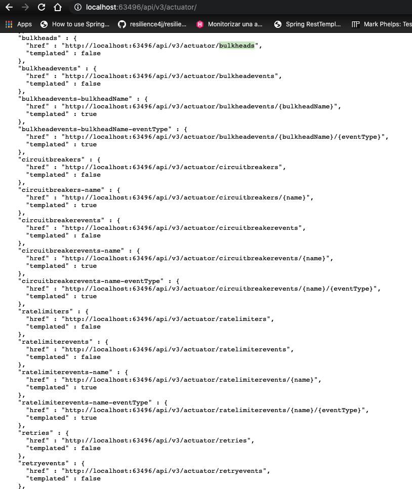
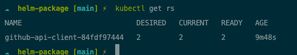

# About this repo

Hi there!! 👋

This repo is about a Spring Boot Client application to integrate with the GitHup API , specifically with the Githup Search API. 


# Requirements

Following, the original requirements:

## Service Specifications. (Functional Requirements)
   * Given a city name (e.g. Barcelona) the service returns a list of the top contributors (sorted by number of repositories) in GitHub.
   * The service should give the possibility to return Top 10, 50 or 100 contributors.
   * The service can be implemented using any set of technologies (language, framework, libraries), but we are more comfortable with Java and Go
   * The service should make use of the GitHub REST API (https://docs.github.com/en/free-pro-team@latest/rest)

## Requirements. (Non Functional Requirements) 
   * Make sure to accommodate to the GitHub rate limits
   * Paying attention to concurrency and other scalability issues will be highly appreciated.
   * Provide a way for spinning up the system (e.g. docker-composer, docker-stack, kubernetes, etc)
   * The system needs to be fault tolerant and highly available

# Technical Decisions

The technical decisions are based on the requirements specified above and taking into account the time I have to deliver the demo.

## About the Service Specification: (Functional Requirements)

   * I decided to implement this integration with SpringBoot because it offers a quick and easy way to implement a configuration-based Rest Client. I can configure the integration easily and be focused in other requirements.
   * For a "real and production ready service", probably I would rather to use Java Standar or Go, and some third party libraries, basically for reducing the "magic",not be tied to a framework, and maybe to improve the performance as well
   * The implementation and Client configuration is based on the Github official documentation.I focused on the Github Search API documentation,and I have to said that the documentation is not entirely clear and there are some gap
   * The integration approach: This is based on a server to server communication, where we deploy a SpringBoot API that uses a Rest Client on the service layer to integrate with the  Github API.
   * I decide to use [Apache HTTPClient](https://hc.apache.org/httpcomponents-client-5.0.x/index.html) for the Github Rest Client Side. This library provides a connection pool manager that allows us to connections,timeouts,
     number of connections and a long etc.For more details, take a look to *HttpClientConfig.java* class in the project. I would like test [OKHttp](https://square.github.io/okhttp/) but is new for me .
     
## About Requirements: (Non Functional Requirements)

### GitHub Rate Limits

For this requirement, I decide to use [resilience4j](https://resilience4j.readme.io/docs/ratelimiter). For this kind of requirements, we are talking about libraries which implements stability patterns, I have experience using Spring Cloud Stack with Hystrix and Zuul, but I don't like it so much. I did not want to add more and more dependencies and complexity. I have to said that resilience4j is new for me.
    


For more details about the implementation, see the application.yml configuration file and how is configured on the Service layer


     
### Provide a way for spinning up the system:

This project provides different ways to get the system up and running; (like java app, docker, docker-compose, and of course Kubernetes). The solution for this issue has been to use a Makefile
to automate processes to try to improve the developer experience. The makefile looks like follow:


For instance, if you want to execute the local demo using **docker-compose** , just run : 

```code bash 
    make local-demo-start
```

If you have **kubernetes** locally: 

```code bash 
    make h-install
```

And this one, 
```code bash 
    make build ship run 
```
Will build the project locally, running the  test and creating the artifact, then will create the docker image, scan it , publish on the docker registry , and finally will install that image on your local computer using kubernetes


### The system needs to be fault tolerant and highly available. Scalability

**Fault Tolerant**

I have tried to take in count this requirement in every step of the application life-cycle 


Application configuration. 

The application itself, is deployed with springboot actuator enabled and healthcheck endpoints.


And has been configured with resilience4j, so is pretty simple to configure stability patterns, like circuit breaker, bulkheads,etc.





When build the docker image


In the Docker-compose demo 


In the Kubernetes helm package, where I confured a Liveness and Readyness probe in the deployment.


*Highly Available and Scalable:*

Although the local demo is done by default with docker-compose, because it is easier than whoever executes it I have at least docker, the "production" approach was implemented and tested to be deployed in kubernetes. By default, the helm deployment is
configured to deploy a ReplicaSet with 2 instances. 



The scale out , is simple to get , because we can increase the replicas number in the deployment and upgrade the helm release.

The scale up, simple, configuring the resources in the values.yaml

```
resources: {}
  # We usually recommend not to specify default resources and to leave this as a conscious
  # choice for the user. This also increases chances charts run on environments with little
  # resources, such as Minikube. If you do want to specify resources, uncomment the following
  # lines, adjust them as necessary, and remove the curly braces after 'resources:'.
  # limits:
  #   cpu: 100m
  #   memory: 128Mi
  # requests:
  #   cpu: 100m
  #   memory: 128Mi
  
```

# Github Api Client

The following section try to explain more in deep how is build the Api and how to configure your environment for build, and run .

## This project was built  🛠️

* [Intellij]
* [Makefile]
* [SpringBoot]
* [Maven3]
* [Docker and Docker-Compose]
* [Helm]
* [Lens]

## Prerequisites  📋

If you want to work on this project, you will need:

* Java 8
* Make  
* Maven 3
* Docker Desktop 

**Note:** 

Before, use this project, please check the Mafiles command provides, 

   ```sh
     make help
   ```

For custom configuration, for example, ports binding, etc, check the **.env** file 

## Build 🔧

1. Clone the repo
   ```sh
   git clone https://github.com/erasmolpa//github_api_client_spring_boot
   ```
2. Run Make build commands:
   
   ```sh
     make m-install ##For build the java artifact.
   ```
   if you want build the docker image locally
   ```sh
     make build 
   ```

## Run 🚀

**NOTE** The most "complete" way to run, at least from now, is the **docker-compose-demo** option, because deploy, prometheus and grafana as well. 
  For locally demo using docker-compose :

### Docker-Compose

 **Start demo**
  ```sh
     make local-demo-start 
   ```


  **Stop demo**
  ```sh
     make local-demo-stop 
   ```

**Endpoints**

 [!API Endpoint](http://localhost:8080/api/v3/)

 [!Prometheus](http://localhost:9090)

 [!Grafana](http://localhost:3000) (user:admin, pass:foobar)

### Kubernetes
 
You can run the following make command to deploy locally:

**helm install**
  ```sh
     make h-install 
   ```

The helm deployment is configured to expose the API service as NodePort.That means, you will have the service in your localhost and random port. 

  ```sh
    kubectl get svc -n default
  ```


And then navigate to the endpoint


## Testing ⚙️

About project Tests. Are a bit poor. I cannot dedicate all the time I would like to create Mock and integration Testing.

### Test the APi endpoints

Following, let me show you how are mapping the request to the Github API from our Service.

Eg 1 **Get Barcelona City Ranking**

Github API Request --> https://api.github.com/search/users?l=&o=desc&q=location:barcelona&s=repositories&type=Users

Api Client --> http://localhost:8080/api/v3/ranking?location=barcelona|


Eg 2 **Get Barcelona City Ranking Limit result to top 10**

Github API Request --> https://api.github.com/search/users?o=desc&q=barcelona&s=repositories&type=Users&range=10

Api Client --> http://localhost:8080/api/v3/ranking?location=barcelona&limit=10


### All Endpoints /api/v3/actuator/

**Note** Please, acomodate the following endpoints to your local url. This examples are based on the demo endpoint with localhost:8080

All the following end points and more , are available on the Actuator URI
[!SpringBoot Actuator](http://localhost:8080/api/v3/actuator/)

### Api /api/v3/

[!Api Base URI](http://localhost:8080/api/v3/)

[!Api Ranking Endpoint](http://localhost:8080/api/v3/ranking)

[!Api Rate Limit Endpoint](http://localhost:8080/api/v3/rate_limit)

### Instrumentation 

#### /health  
[!Api Health Check](http://localhost:8080/api/v3/actuator/health)

#### /actuator/metrics
[!Api Metrics](http://localhost:8080/api/v3/actuator/metrics) -- > Example [!http request](http://localhost:8080/api/v3/actuator/metrics/http.server.requests)

#### /actuator/prometheus 
[!Api Prometheus Scrapping Endpoint](http://localhost:8080/api/v3/actuator/prometheus)

#### /actuator/ratelimiters
[!Api Resilience Endpoint. Rate Limiter](http://localhost:8080/api/v3/actuator/ratelimiters) ## Services under a RateLimit configuration


## Roadmap and Improvements 🚀

For a production ready approach, This project should:

🚧 Add CI and CD process.

🚧 Add Integration Testing.

🚧 Improve the Exception management.

🚧 Improve the Log digest management with interceptors.

🚧 Add Swagger support for auto document our API.

🚧 Improve the Rate Limit configuration. Eg. Is not the same rate limit for users authenticates than not authenticated, enterprise or not enterprise account.

🚧 Improve the resilience strategy, adding Circuit Breaker and Bulkhead rules. 

🚧 Add configuration to manage the system and API configuration to deploy into different environments .  

🚧 Make the Services observables. I add configuration to get prometheus basic metrics,but , would be great add New Relic Integration.

🚧 Add Single Sin-On and authentication with Github.

🚧 This Api integration is based on the github Api V3. Thinking in more complex scenarios, and if we add more integrations, will be a must create an anti-corruption layer and validations.

🚧 Improve the security Level in the artifact. I add a Docker Scan check in the Makefile but that should be part of the CI and CD process

🚧 Improve the network configuration of the Helm Package. Adding ssl support and change the service to ClusterIP. The service must be accesible from a Load Balancer or Ingress controller.

See the [open issues](https://github.com/erasmolpa//github_api_client_spring_boot/issues?q=is%3Aissue+is%3Aopen+sort%3Aupdated-desc) for a list of proposed features (and known issues).

<!-- CONTRIBUTING -->
## Contributing 🖇️

Contributions are what make the open source community such an amazing place to be learn, inspire, and create. Any contributions you make are **greatly appreciated**.

1. Fork the Project
2. Create your Feature Branch (`git checkout -b feature/AmazingFeature`)
3. Commit your Changes (`git commit -m 'Add some AmazingFeature'`)
4. Push to the Branch (`git push origin feature/AmazingFeature`)
5. Open a Pull Request

### Versioning 📌

This project use [Semantic Versioning](https://semver.org/lang/es/)


# Contact ✒️

Please contact me in the email **erasmolpa@gmail.com** if you have any cuestion

And if you want, we can connect 😃

<a href="https://twitter.com/erasmolpa">
  
</a>

<a href="https://github.com/erasmolpa">
  
</a>

<a href="https://www.linkedin.com/in/erasmolpa/">
  
</a>

<a href="https://www.instagram.com/erasmolpa/">
  
</a>
<br />
<br />


